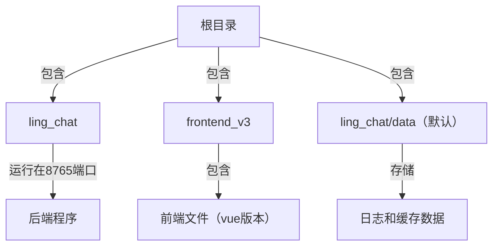
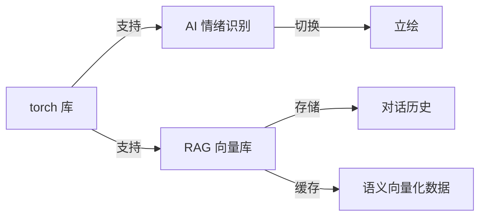

# 项目结构与实现

## 程序入口

### 主程序

- `ling_chat/main.py` 是主程序入口，负责启动后端服务（监听 env 文件里面指定配置的端口）
- 你也可以直接在浏览器访问 `localhost:8765`，体验完整功能。
- 使用根目录下的 `start.bat`，会自动激活 `venv` 虚拟环境并启动主程序。
- 项目配置集中在 `.env` 文件，访问网页的 **高级设置** 可自动读取并生成可视化配置界面

## 程序结构

- `ling_chat` 目录包含基于 Python 的后端服务，负责监听指定端口。
- `ling_chat/static` 目录存放前端资源，包括 静态资源、vue前端代码 等文件。
- `ling_chat/data` 默认情况下用于存储日志、对话记录及缓存数据。此目录内容可安全删除，但如需备份聊天记录请提前保存。

## 其他相关

### torch 与神经网络库依赖

- 项目采用自训练模型，通过 torch 库识别 AI 当前情绪，实现立绘自动切换。
- 集成 RAG 向量库，实现永久记忆系统：
  - 启用 RAG 后，对话内容以 JSON 格式存储于 `ling_chat/data/rag_chat_history/`。
  - 语义向量化结果缓存在 `ling_chat/data/chroma_db_store/`。注意：缓存不支持自动删除，如需手动修改或清理 `rag_chat_history/`，请同时删除整个 `chroma_db_store/` 文件夹以保证记忆库同步。
- 计算资源需求较低，仅需 torch-cpu，普通 4 代 i3 以上电脑即可流畅运行
